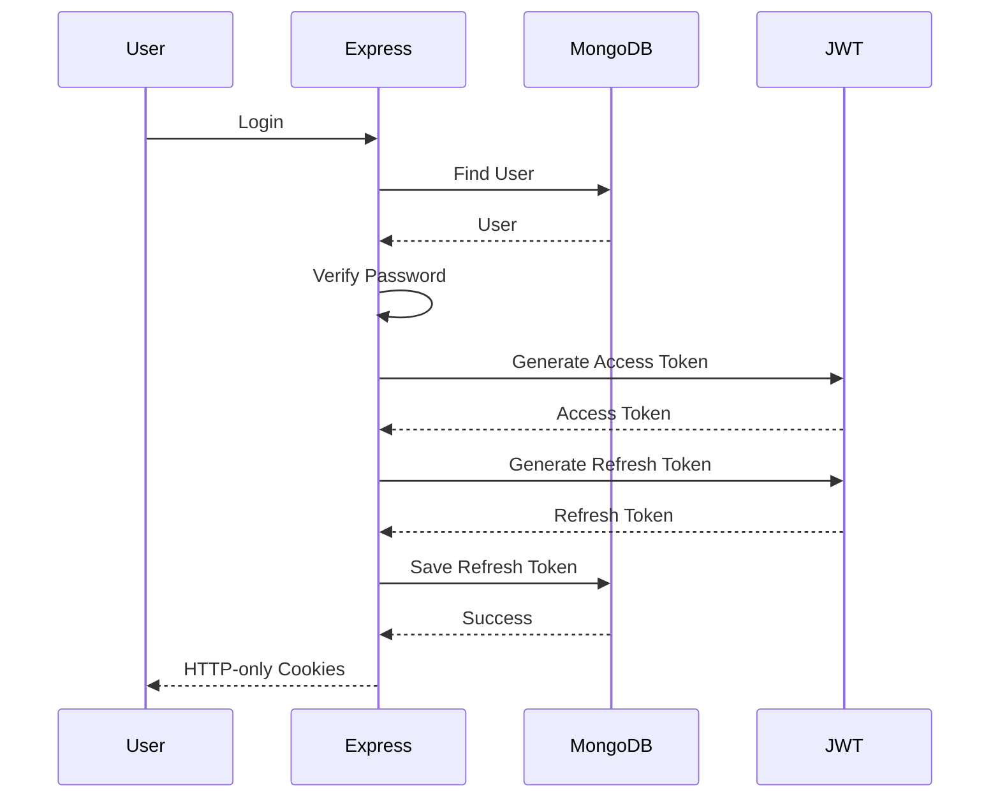

#structured backend of the social media and video upload 


#  JWT Authentication API with Access & Refresh Tokens

A production-inspired authentication system built with **Node.js**, **Express.js**, **MongoDB**, and **JWT** that implements secure user authentication using **Access Tokens**, **Refresh Tokens**, **HTTP-only Cookies**, **bcrypt password hashing** AND **Multer**, and **Cloudinary** for file(in this picture) uploads.

This project demonstrates how modern authentication systems manage user sessions securely while following clean architecture and modular development practices.

---

##  Features

* ✅ User Registration
* ✅ User Login
* ✅ Secure Password Hashing with bcrypt
* ✅ JWT Access Token Authentication
* ✅ JWT Refresh Token Authentication
* ✅ HTTP-only Secure Cookies
* ✅ Refresh Token Storage in MongoDB
* ✅ Refresh Token Rotation
* ✅ Protected Routes using Middleware
* ✅ User Logout
* ✅ Cloudinary Image Upload
* ✅ Centralized Error Handling
* ✅ Clean MVC Architecture
* ✅ Mongoose Custom Methods
* ✅ Async Error Handler

---

#  Tech Stack

### Backend

* Node.js
* Express.js

### Database

* MongoDB
* Mongoose

### Authentication

* JSON Web Token (JWT)
* bcrypt
* cookie-parser

### File Upload

* Multer
* Cloudinary

### Utilities

* dotenv
* CORS

---

#  Project Structure

```text
.
├── src
│   ├── controllers
│   │     user.controller.js
│   │
│   ├── db
│   │     connection.js
│   │
│   ├── middlewares
│   │     auth.middleware.js
│   │     multer.middleware.js
│   │
│   ├── models
│   │     user.model.js
│   │
│   ├── routes
│   │     user.routes.js
│   │
│   ├── utils
│   │     ApiError.js
│   │     ApiResponse.js
│   │     asyncHandler.js
│   │     fileUpload.js
│   │
│   └── app.js
│
├── public
├── server.js
├── package.json
└── README.md
```

---

#  Authentication Flow

```text
Register User
      │
      ▼
Validate Input
      │
      ▼
Upload Images
      │
      ▼
Hash Password
      │
      ▼
Store User
      │
      ▼
Login
      │
      ▼
Generate Access Token
Generate Refresh Token
      │
      ▼
Save Refresh Token
      │
      ▼
Send HTTP-only Cookies
      │
      ▼
Access Protected Routes
      │
      ▼
Access Token Expires
      │
      ▼
Refresh Access Token
      │
      ▼
Continue Session
```

---

#  Authentication Lifecycle



---

# 📌 API Endpoints

REGISTER = /api/v1/users/register
LOGIN = /api/v1/users/login
LOGOUT = /api/v1/users/logout
REFRESH TOKEN = /api/v1/users/refresh-token


# 🔐 Security Features

* Password hashing using bcrypt
* Access Tokens with expiration
* Refresh Tokens with expiration
* Refresh Token stored in MongoDB
* HTTP-only Cookies
* Secure Cookies
* JWT Verification Middleware
* Password excluded from API responses
* Refresh Token excluded from API responses
* Centralized Error Handling
* Input Validation
* Modular Architecture

---

#  Installation

Clone the repository

```bash
git clone https://github.com/prabin761/video-media.git
```

Move into the project directory

```bash
cd social
```

Install dependencies

```bash
npm install
```

Create a `.env` file in the root directory.

Example:

```env
PORT=8000

DATABASE_URI=your_mongodb_connection_string

ACCESS_TOKEN_SECRET=your_access_secret

ACCESS_TOKEN_EXPIRY=15m

REFRESH_TOKEN_SECRET=your_refresh_secret

REFRESH_TOKEN_EXPIRY=7d

ALLOWED_ORIGIN=http://localhost:3000 || which origin you want allow || (simply origin of your frontend)

CLOUDINARY_CLOUD_NAME=your_cloud_name

CLOUDINARY_API_KEY=your_api_key

CLOUDINARY_API_SECRET=your_api_secret
```

Start the development server

```bash
npm run dev
```

or

```bash
npm start
```

---

# 🧪 Testing the API

You can test the API using:

* Postman
* Thunder Client
* Insomnia

Recommended flow:

1. Register a new user.
2. Log in to receive Access and Refresh Token cookies.
3. Access a protected route.
4. Refresh the Access Token when it expires.
5. Log out to invalidate the session.

---

# 🚀 Future Improvements

* Role-Based Access Control (RBAC)
* Email Verification
* Password Reset
* OAuth (Google, GitHub)
* Two-Factor Authentication (2FA)
* Rate Limiting
* Multi-device Login
* Session Management
* Token Family Rotation
* CSRF Protection
* Audit Logging

---

# 📚 What I Learned

Through this project I gained practical experience with:

* Building secure authentication systems
* JWT Access & Refresh Token workflows
* Password hashing with bcrypt
* HTTP-only Cookie Authentication
* Express Middleware
* Mongoose Model Methods
* MongoDB Data Modeling
* REST API Design
* Cloudinary Integration
* Error Handling Patterns
* Modular Project Architecture
* Secure Session Management

---

#  Contributing

Contributions, issues, and feature requests are welcome.

If you have suggestions for improvements, feel free to open an issue or submit a pull request.

---


---

# 👨‍💻 Author

**Prabin Bhusal**

If you found this project useful, consider giving it a ⭐ on GitHub.
